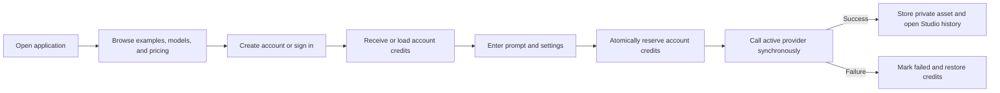
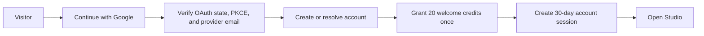

# Qwen Image Generator Hub — Product Requirements

> - Document status: Implementation-aligned draft v1.3
> - Last verified: July 24, 2026
> - Release status: Cloudflare custom-domain acceptance environment deployed and smoke-tested; Checkout enabled by explicit owner decision; production approval blocked
> - Scope: English web MVP, accounts, Studio, credits, billing adapter, and developer API
> - Positioning: Independent third-party product; not affiliated with or endorsed by Alibaba or the Qwen team

This document separates the repository's current behavior from the target product contract. [Release Readiness](./docs/RELEASE_READINESS.md) is authoritative for launch blockers; [Architecture](./docs/ARCHITECTURE.md) is authoritative for implementation structure.

## 1. Status Vocabulary

| Status | Meaning |
|---|---|
| **Verified locally** | Implemented and exercised by current automated or local runtime evidence |
| **Implemented, external verification pending** | Adapter or flow exists, but real provider credentials and provider-side behavior have not been accepted |
| **Planned** | Product requirement with no complete implementation |
| **Blocked** | Must not be enabled or presented as production-ready until its release gate passes |

No locally verified state implies merged, deployed, publicly available, commercially approved, or legally approved.

## 2. Product Definition

Qwen Image Generator Hub lets visitors explore models, examples, and pricing publicly. Image generation begins after account creation or sign-in, uses an account credit balance, stores private work in Studio, and optionally exposes the same generation contract through a scoped API key.

### Product principles

- **Account before generation:** visitors may explore publicly, but generation and private assets require a signed-in account.
- **English-only MVP:** customer-facing UI contains no language selector or mixed-language release surface.
- **Private by default:** generations are never public without a future, separate consent flow.
- **Honest model status:** local preview, configured production provider, and planned integrations must remain visibly distinct.
- **Explainable credits:** reservations, settlements, refunds, and grants are transactionally recorded.
- **Replaceable providers:** stored generation and API contracts do not expose provider-specific request shapes.
- **No unsupported launch claims:** model releases, prices, licenses, retention, and commercial terms require current evidence.

### Audiences

1. A first-time user who needs examples and simple defaults.
2. A creator who needs repeatable formats, projects, history, and favorites.
3. A developer who needs a stable authenticated generation endpoint.
4. A product evaluator who wants to inspect the workflow, examples, model status, and pricing before registration.

## 3. Current Implementation Baseline

| Capability | Current status | Production requirement |
|---|---|---|
| Homepage and navigation | **Verified locally** | Accessibility and browser acceptance evidence |
| Account-gated generation | **Externally verified once in acceptance** with a signed-in requirement, server-authoritative credit settlement, private R2 persistence, and browser rendering | Failure/timeout recovery, backup-deletion telemetry, and production monitoring |
| Real image provider | **Kie.ai signed-in success path externally verified once** for `qwen2/text-to-image`; **external verification pending** for Alibaba Cloud `qwen-image-2.0-pro` | Approved provider contract, license, cost model, failure/timeout behavior, and rollback |
| Qwen Image 3 | **Blocked**; no verified provider integration or official release source is recorded | Official source plus implemented and accepted provider adapter |
| Account access | **Google-only in the customer-facing acceptance UI**; retained email/password, verification, and recovery APIs are locally verified but not exposed as sign-in options | Google denial/failure acceptance, production account-recovery decision, and security review |
| Google/GitHub OAuth | **Google verified once and published for external accounts in acceptance; GitHub adapter implemented but not offered and externally unverified** | Reviewed deployment provenance, denial/failure acceptance, and GitHub callback acceptance before any UI enablement |
| Welcome credits | **Implemented and deployed in acceptance** as one idempotent 20-credit grant at account creation or the first subsequent login for an older account | Reconciliation monitoring |
| Credits | **Verified locally, in the isolated Sandbox, and once in the Cloudflare acceptance flow** for generation reservation/settlement; non-negative billing-loss recovery and aggregate billing-health alert delivery also passed | Reconciliation monitoring |
| Studio | **Verified locally** for login-directed responsive workspace, persistent light/dark theme control, aggregate overview, create, projects, history/failure states, favorites, credits, billing, payments, scoped keys, API activity, private support tickets, profile, and settings | Search/filter depth, support operations tooling, and production operational analytics |
| Stripe adapter | **Implemented, locally verified, and accepted across the configured lifecycle in an isolated Stripe/Cloudflare Sandbox; blocked for public use** | Legal/commercial approval and broader reconciliation monitoring |
| Developer API | **Verified locally; pre-release route deployed** with `generations:write` scope, relational limits, request logs, and synchronous generation | Per-key budgets, async jobs, webhooks, and production observability |
| Storage | **Pre-release deployed** with D1 metadata/ledger and private R2 assets; Wrangler uses the same binding model locally | Backup/rollback evidence, lifecycle approval, retention telemetry, and restore exercise |
| Content library | **Prototype**: twelve prompt records, eight unique example cards, and eleven homepage FAQs | 60/80-item editorial inventory and content review workflow |

## 4. Current User Experience

### Public routes

| Route | Current behavior |
|---|---|
| `/` | Homepage and generator entry; successful signed-in generations hand off directly to private Studio history instead of rendering inline results, followed by product sections, pricing preview, and FAQ |
| `/examples` | Eight unique curated cards |
| `/models` | Configured Qwen 2.0 adapter and Qwen Image 3 roadmap status |
| `/pricing` | Starter, Creator, and Professional monthly/yearly comparison; yearly is selected by default. When an environment explicitly enables a configured offer, selection records the disclosed current-policy confirmation and starts Stripe Checkout; an unauthenticated selection resumes after Google sign-in |
| `/privacy` | Pre-release privacy and data notice covering account, creative, billing, support, analytics, provider, retention, export, and deletion boundaries without claiming launch-region legal approval |
| `/terms` | Approved versioned Billing Terms for subscriptions, credits, renewal, cancellation, payment review, and account deletion |
| `/refund-policy` | Approved versioned Refund Policy covering eligibility, subscriptions, credit packs, disputes, and private support requests |
| `/status` | Independent product, runtime, deployment, billing-gate, and verification status with explicit pre-release boundaries |
| `/support` | Public support orientation and security guidance leading to private signed-in tickets in Studio |
| `/guides` | English guide overview |
| `/api` | Developer API overview and request example |
| `/verify-email` | Consumes a one-time verification token, then returns home |
| `/reset-password` | Opens the password reset dialog with a one-time token |

Unknown client-side and API routes return dedicated 404 experiences.

### Authenticated routes

| Route | Current behavior |
|---|---|
| `/studio` | Signed-in generation with optional project assignment; successful requests open `/studio/history`, and this remains the default workspace landing route |
| `/studio/new` | Backward-compatible alias for the signed-in generation workspace |
| `/studio/overview` | Plan, balance, current-month usage, active-key count, recent work, and normalized account activity |
| `/studio/projects` | Create, archive, and restore projects |
| `/studio/history` | Recent account generations |
| `/studio/favorites` | Favorited generations |
| `/studio/credits` | Available/reserved balances and ledger entries |
| `/studio/billing` | Billing state, configured Stripe offers, history, and Customer Portal entry |
| `/studio/payments` | Reconciled Checkout orders, recorded spend, refunds, and disputes |
| `/studio/api-keys` | Issue once-visible hashed keys and revoke them |
| `/studio/api-activity` | Review authenticated request status, latency, key association, and request IDs |
| `/studio/support` | Open, review, reply to, close, and reopen user-owned private support tickets |
| `/studio/profile` | Workspace identity, membership date, plan, and email verification state |
| `/studio/settings` | Verification, profile, password, sessions, export, and fail-safe external-first account deletion |

### Global navigation requirements

- Desktop navigation contains Generator, Examples, Models, Pricing, and Guides.
- The active route uses `aria-current="page"`.
- Signed-out actions expose Sign in and Create account.
- Signed-in actions expose credits and an account menu.
- Mobile navigation exposes every public destination, Studio when signed in, theme control, and authentication state.
- A future accessibility gate must verify focus restoration, Escape handling, scroll locking, and screen-reader behavior.

## 5. Core Flows

### 5.1 Account-gated creation



Current rules:

- Prompt length is 3–1000 characters.
- Aspect ratios are 1:1, 3:2, 16:9, 4:3, and 9:16.
- Styles are Photorealistic, Editorial, Cinematic, and Illustration.
- Quality costs are Standard 4, High 8, and Ultra 16 account credits.
- Signed-out requests to generation, history, images, and deletion return an authentication error.
- Provider failure restores the reserved account credits.
- Successful assets are private; unpaid account downloads use the product’s visible standard-export watermark, while every active paid tier may download the original.

Completed and failed records render in Studio history. Completed cards expose download, favorite, variation, and permanent removal; failed cards expose an explicit no-charge state, retry, and removal.

### 5.2 Account access and retained credential routes



- The canonical customer UI currently exposes Google sign-in only. Google provides the verified email used for account identity and developer access.
- Email/password registration, verification, login, and recovery routes remain implemented and locally tested in the Worker, but they are not exposed as customer-facing sign-in options and production account email is disabled.
- In the retained credential routes, verification tokens expire after 24 hours and reset tokens expire after 60 minutes.
- The 20-credit welcome grant is issued once at registration; the first subsequent login safely backfills it for an older account that never received a signup grant.
- For retained email/password accounts, email verification protects recovery and remains required for developer-key issuance; it does not gate welcome credits.
- Retained password reset revokes all account sessions, while password change keeps the current session and revokes other sessions.
- Google and GitHub OAuth use state and PKCE and require a verified provider email.
- OAuth access tokens are used only for profile exchange and are not persisted.

### 5.3 Studio and data ownership

- Every project and account generation query is scoped to the authenticated user.
- A generation may be assigned only to an active project owned by that user.
- API key secrets are shown once; only a SHA-256 hash and prefix are stored.
- Account export excludes password hashes, API key secrets, and image bytes.
- Account deletion cancels a stored Stripe subscription and deletes the Stripe Customer before the local cascade.
- If external billing cleanup fails, local identity and data remain intact so the user can retry safely.

### 5.4 Credits and generation settlement

1. Validate the request and project ownership.
2. Atomically move the estimated cost from available to reserved.
3. Persist a processing generation.
4. Call the active provider.
5. On success, persist the asset and settle reserved credits.
6. On provider or system failure, mark the generation failed and refund the reservation.

The ledger is append-only in normal application flows. Startup and 15-minute maintenance recover stranded reservations and stale processing generations. Production acceptance still requires reconciliation monitoring and operational alerts.

### 5.5 Billing

Implemented adapter flow:

1. Pricing defaults to yearly billing and supports Starter, Creator, and Professional monthly/yearly subscriptions.
2. Starter is USD 9.90/month for 500 credits or USD 99/year for 6,000 credits.
3. Creator is USD 29.90/month for 2,000 credits or USD 299/year for 24,000 credits.
4. Professional is USD 59.90/month for 5,000 credits or USD 599/year for 60,000 credits.
5. One-time packs are USD 12/400 credits, USD 30/1,200 credits, and USD 60/3,000 credits.
6. Monthly invoices grant the monthly allowance; yearly invoices grant the full annual allowance once after payment.
7. A verified user selects a server-defined offer on `/pricing`; the client records the clearly disclosed current policy confirmation and immediately creates or reuses a Stripe Customer before redirecting to Stripe-hosted Checkout. An unauthenticated selection resumes after Google sign-in without a second purchase click.
8. A signed webhook claims a retryable event state, validates the exact immutable Price version, amount, currency, Customer, subscription, invoice reason, and PaymentIntent, then records completion only after fulfillment.
9. Refunds and disputes update financial status and pause credit spending for review.
10. Actionable Radar early fraud warnings resolve to a known local PaymentIntent, create a separate risk record, and pause credit spending without being treated as a refund or dispute.
11. All actionable triggers for one PaymentIntent are consolidated into one review. A cleared false positive restores access; a confirmed loss reclaims at most currently available credits, never creates a negative balance, and keeps the account blocked while loss remains.
12. Checkout requires a server-recorded acceptance of the current Billing Terms and Refund Policy and carries that version into the local attempt and Stripe metadata.
13. The 15-minute schedule deduplicates aggregate billing-health alerts, sends reminders and recovery messages, and audits every delivery.
14. The Customer Portal manages the external subscription after a customer exists.

Billing is fail-closed by default, with `BILLING_ENABLED=true` recorded as an explicit repository-owner override for the canonical acceptance Worker on July 24, 2026. The old launch and pack Price versions are retained but retired for historical reconciliation. New Checkout requires the switch, the current Price ID environment variable, a matching active D1 price-version row, and account acceptance of the current billing-policy version. Configured webhook settlement and Stripe-side cleanup remain active independently of the switch. The isolated Sandbox has accepted every configured monthly/yearly offer, credit-pack fulfillment, renewals, failed-payment recovery, Portal and terminal cancellation, refund, dispute, Radar, missing-order recovery, account-deletion races, and authenticated risk resolution. Policy version `2026-07-23` has product-owner approval and is deployed; Cloudflare accepted and logged a real test alert to the verified destination. Checkout enablement is an acceptance-environment operating decision, not production approval; [Release Readiness](./docs/RELEASE_READINESS.md) remains blocked on the other legal, provider, reconciliation, and release gates.

### 5.6 Developer API

Current public developer route:

| Method | Route | Contract |
|---|---|---|
| `POST` | `/v1/generations` | Bearer API key; synchronous generation; optional `Idempotency-Key` up to 128 characters |

Request:

```json
{
  "model": "qwen2/text-to-image",
  "prompt": "A glass pavilion at dawn",
  "aspect_ratio": "16:9",
  "style": "editorial",
  "quality": "standard",
  "project_id": null
}
```

The `model` field may be omitted to select the server's only available runtime; unavailable IDs are rejected. The same completed idempotency key returns the stored generation for 24 hours; a concurrent request receives `409 REQUEST_IN_PROGRESS` with `Retry-After`, and a stored failure is replayed without charging again. Keys carry an explicit `generations:write` scope. D1 stores rate-limit buckets and every request result, duration, request ID, and available user/key association. Per-key budgets, async reads/cancellation, developer webhooks, cursor pagination, and version deprecation policy are planned.

## 6. Data, Privacy, and Security Contract

### Current verified safeguards

- The canonical Worker uses salted PBKDF2-SHA-256 password hashes with the work factor encoded beside each hash.
- Session, security, OAuth state, and API key tokens are stored as hashes where appropriate.
- Account and generation ownership checks run on the server.
- Cookies are HttpOnly and SameSite=Lax; production HTTPS configuration adds Secure and HSTS.
- Security headers include CSP, frame denial, MIME sniffing protection, and a restrictive permissions policy.
- OAuth uses one-time state and PKCE.
- Stripe webhooks require a timestamped HMAC signature over the raw body.
- Request bodies and provider assets have size limits.

### Current limitations

- New guest sessions and guest generations are disabled. Legacy guest rows remain cleanup-only until previously created assets are drained.
- Starter-account retention and backup-deletion timing are not implemented.
- Rate limiting is IP-based and persisted in D1 locally and in acceptance; production per-account/key budgets and load acceptance remain pending.
- Provider API and asset URLs require HTTPS and exact configured hosts; redirects are rejected. Assets also require allowed MIME types, valid signatures, and size limits.
- D1 uses ordered forward-only SQL migrations. Rollback/upgrade exercises remain pending.
- OAuth, email, Stripe, generation, and asset-download calls have explicit timeouts; provider-specific retry budgets remain pending.
- Production privacy notice, terms, commercial-use statement, and launch-region review are pending.

### Target retention policy

- Legacy guest assets: continue to use the existing 24-hour cleanup until drained.
- Starter-account assets: 30 days by default, subject to product and legal approval.
- Paid retention: plan-defined only after billing and legal approval.
- Backups: published deletion window and tested restoration procedure.

The target policy must not be advertised as current behavior until cleanup telemetry proves it.

## 7. Technical Direction

### Current architecture

- React single-page application built by Vite.
- A Hono Worker is the single active business backend in Wrangler development and Cloudflare acceptance; Pages remains a fallback URL.
- D1 stores relational records; private R2 stores generation source assets.
- The Express/SQLite implementation is retained only as a legacy comparison adapter and is excluded from default scripts and deployment documentation.
- Generation executes synchronously inside the HTTP request.
- One active provider is selected by Worker environment: local preview, Alibaba Cloud Model Studio, or Kie.ai Qwen Image 2.
- Rate-limit buckets, API request logs, idempotency state, maintenance runs, and cleanup compensation live in D1.

### Target production architecture

- Durable asynchronous generation queue and monotonic task state machine.
- D1 as the selected relational database, pending backup/restore/load approval.
- R2 as the selected private object store, pending lifecycle and deletion approval.
- Shared rate limiting, reconciliation workers, metrics, traces, alerts, and audit events.
- Versioned database migrations with backup and rollback evidence.
- Provider allowlists, circuit breakers, retry budgets, and cost monitoring.
- CDN and responsive thumbnails for galleries.

The target architecture is not a claim about the current repository.

## 8. Content and Quality Requirements

### MVP content target

- At least 60 reviewed examples with prompt, settings, model/version, and provenance.
- At least 80 reviewed English prompt templates across primary use cases.
- At least ten homepage FAQ answers covering quota, retention, migration, credits, privacy, commercial use, model status, moderation, deletion, and shared API credits.
- Model claims include source, model version, evaluation date, method, and limitations.
- Planned integrations never use an Available badge.

### Accessibility target

- WCAG 2.2 AA on critical flows.
- Visible labels, associated errors, keyboard operation, focus management, and reduced-motion support.
- Selection and error state never rely on color alone.
- Generated-image alt text uses a safely truncated prompt summary.

### Performance target

| Metric | Target |
|---|---:|
| Homepage JavaScript gzip | ≤ 180 KB |
| Non-generation API p95 | ≤ 400 ms in-region |
| Task creation p95 after async migration | ≤ 800 ms |
| Monthly availability after production launch | ≥ 99.9% |
| Ledger reconciliation accuracy | 100% |

The current production-mode bundle passes the JavaScript size target locally. No public Core Web Vitals or availability evidence exists.

## 9. Roadmap

### Completed and locally verified

- English responsive public interface and navigation.
- Worker-backed account-gated generation, download, credit settlement, and history.
- Google-only customer account access plus session management.
- Retained, locally verified email/password authentication, verification, and recovery routes, and Google/GitHub OAuth adapters.
- Projects, favorites, account export, and externally checkpointed deletion.
- Credit ledger and generation reserve/settle/refund.
- Hashed API keys and synchronous idempotent developer generation.
- Stripe adapter and signed webhook tests.
- Alibaba Cloud Qwen 2.0 adapter mapping and binary persistence tests.
- Recoverable Stripe events, validated invoices, consolidated refund/dispute/Radar review, authenticated non-negative recovery, and external-first account deletion.
- Versioned billing-policy acceptance, approved renewal/refund copy, and externally delivered aggregate billing-health alerts.
- Forward-only migrations, scheduled retention/recovery maintenance, D1-backed rate limits, complete API result logs, R2 cleanup compensation, exact-host provider protection, explicit failed states, and 404 routes.

### Release-blocking work

- Add broader financial reconciliation and availability supervision beyond the accepted billing-health email path.
- Prove account retention against backup deletion and production telemetry.
- Push the current acceptance revision, complete CI and review, merge the hardening branch, and then create the reviewed release marker.
- Complete real provider, email, GitHub OAuth, and Google denial/failure acceptance.
- Complete accessibility, browser, mobile, security, and container acceptance.
- Approve legal, privacy, commercial-use, pricing, tax, and launch-region decisions.

### Post-MVP work

- Async queue, status polling, cancellation, retries, and developer webhooks.
- Uploads, reference images, inpainting, seeds, negative prompts, and batch generation.
- Search, filters, trash/restore, parent/variation relationships, and extended project workflows.
- Usage analytics and per-key budget controls.
- Additional providers only after objective evaluation and legal approval.
- Additional languages only through a separately approved localization scope.

## 10. Open Decisions

| ID | Decision | Owner | Required before |
|---|---|---|---|
| `TBD-BUSINESS-001` | Launch countries, tax handling, refunds, disputes, and final credit-expiry policy | Product + Finance + Legal | Production-approved public billing |
| `TBD-MODEL-001` | Approved production model ID, provider contract, regions, license, SLA, and whether a future Qwen Image 3 offering exists | AI + Legal | Real provider launch |
| `TBD-LEGAL-001` | Launch countries, privacy obligations, residency, age limits, commercial-use disclosure, and provider data use | Legal | External beta |
| `TBD-RETENTION-001` | Starter, paid, backup, and billing-record deletion periods | Product + Legal + Infrastructure | External beta |
| `TBD-INFRA-001` | Production database, object storage, queue, rate limiter, observability, backup, and rollback platform | Engineering | Production deployment |

Closed decisions:

- `DEC-AUTH-001`: The canonical acceptance UI uses Google-only account access. Email/password and GitHub routes remain implemented but are not customer-facing until their recovery, delivery, and external-acceptance paths are explicitly approved. Phone authentication is deferred.
- `DEC-I18N-001`: MVP is English-only with no language switch. Additional locales are post-MVP and require separate review.
- `DEC-BILLING-001`: The product uses three subscription tiers, monthly/yearly billing with yearly selected by default, 4/8/16 generation costs, and the fixed prices and allowances documented in section 5.5.

## 11. Release Acceptance

### Locally verified

- [x] Signed-out visitors cannot generate, list generations, fetch private images, or delete generation records.
- [x] New accounts receive one idempotent 20-credit welcome grant.
- [x] Email verification remains separate from the welcome grant and protects recovery/developer access.
- [x] Account and API generation share the credit ledger.
- [x] Projects, history, favorites, API keys, sessions, export, and local deletion have automated flow coverage.
- [x] Strict TypeScript, React Hooks, basic JSX accessibility checks, automated tests, production build, and production-artifact scan pass locally.
- [x] Production and full development dependency audits report zero findings after upgrading Wrangler to 4.114.0 and Miniflare to 4.20260722.0.
- [x] Production JavaScript gzip is below 180 KB.
- [x] Legacy guest assets continue to be deleted after 24 hours by tested scheduled maintenance.
- [x] Unsupported Qwen Image 3 release marketing is removed from the live UI.
- [x] Billing events are retryable; invoices are validated; refunds/disputes quarantine spending; account deletion is external-first.
- [x] API scopes/result logs, persisted limits, concurrent D1 credit invariants, failed states, and dedicated 404 routes are locally verified.

### Required before external beta

- [x] The unsupported Qwen Image 3 release claim is removed from the product UI.
- [ ] Account primary-storage and backup deletion, approved policy, and production overdue telemetry remain to verify.
- [ ] Google completed one successful acceptance callback and is published for external accounts; production email, GitHub OAuth, and Google denial/failure acceptance remain.
- [ ] Browser, mobile, keyboard, screen-reader, and reduced-motion acceptance is documented.
- [ ] Content inventory and FAQ meet the MVP target.
- [ ] Legal, privacy, provider-license, commercial-use, and launch-region decisions are approved.

### Required before production-approved public billing

- [x] Account deletion cancels external subscriptions/customers first and passed active, trialing, past-due, already-canceled, cancel-at-period-end, and late-webhook Sandbox cases.
- [x] Webhook processing recovers missing orders, out-of-order financial events, failed renewals, and deleted-account races.
- [x] Invoice grants validate customer, subscription, expected Price, amount, currency, and billing reason for every configured monthly/yearly offer.
- [x] Refunds, disputes, Radar, synchronous payment failure, payment recovery, and a seven-check D1 reconciliation passed. Delayed payment methods are disabled; asynchronous success retains signed-event coverage.
- [x] Stripe Sandbox Checkout, webhook replay, Customer Portal, renewal, cancellation, and deletion pass end to end.
- [x] Policy version `2026-07-23` covers taxes, renewal, cancellation, refunds, and credit lifetime; product-owner approval is recorded and the canonical terms/refund pages are deployed.

### Required before production deployment

- [x] A committed Git baseline and required CI checks exist.
- [ ] Versioned migrations, backup restore, rollback, and deletion exercises pass.
- [x] Cloudflare custom-domain Worker/D1/R2 acceptance deployment is built and smoke-tested.
- [x] Build and deploy the acceptance environment from a committed immutable revision.
- [ ] Prove production rollback and D1 restore.
- [ ] Shared rate limiting, monitoring, alerting, request correlation, and secret management are active.
- [ ] Production provider quality, safety, cost, timeout, and rollback gates pass.
- [ ] There are zero open P0/P1 defects.

## 12. Definition of Completion

The release is complete only when every applicable checkbox above has linked evidence, every open decision required for that release is closed, the target revision is merged and deployed, and the canonical user-facing service has been verified. Local tests, a successful build, adapter code, or a healthy local endpoint alone do not constitute launch completion.
