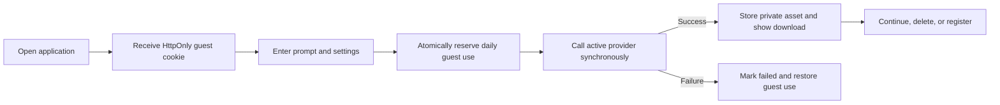
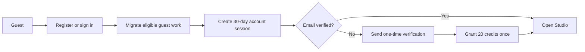

# Qwen Image Generator Hub — Product Requirements

> - Document status: Implementation-aligned draft v1.3
> - Last verified: July 23, 2026
> - Release status: Cloudflare custom-domain acceptance environment deployed and smoke-tested; production launch and public billing blocked
> - Scope: English web MVP, accounts, Studio, credits, billing adapter, and developer API
> - Positioning: Independent third-party product; not affiliated with or endorsed by Alibaba or the Qwen team

This document separates the repository's current behavior from the target product contract. [Release Readiness](./docs/RELEASE_READINESS.md) is authoritative for launch blockers; [Architecture](./docs/ARCHITECTURE.md) is authoritative for implementation structure.

## 1. Status Vocabulary

| Status | Meaning |
|---|---|
| **Verified locally** | Implemented and exercised by current automated or local runtime evidence |
| **Implemented, external verification pending** | Adapter or flow exists, but real provider credentials and provider-side behavior have not been accepted |
| **Planned** | Product requirement with no complete implementation |
| **Blocked** | Must not be enabled or presented as production-ready until its release gate passes |

No locally verified state implies merged, deployed, publicly available, commercially approved, or legally approved.

## 2. Product Definition

Qwen Image Generator Hub helps a visitor create a private image from a plain-English prompt before registration. The user can then register, migrate recent guest work, organize generations in Studio, inspect credit activity, and optionally call the same generation contract with an API key.

### Product principles

- **Experience before registration:** the first successful generation must not require an account.
- **English-only MVP:** customer-facing UI contains no language selector or mixed-language release surface.
- **Private by default:** generations are never public without a future, separate consent flow.
- **Honest model status:** local preview, configured production provider, and planned integrations must remain visibly distinct.
- **Explainable credits:** reservations, settlements, refunds, and grants are transactionally recorded.
- **Replaceable providers:** stored generation and API contracts do not expose provider-specific request shapes.
- **No unsupported launch claims:** model releases, prices, licenses, retention, and commercial terms require current evidence.

### Audiences

1. A first-time user who needs examples and simple defaults.
2. A creator who needs repeatable formats, projects, history, and favorites.
3. A developer who needs a stable authenticated generation endpoint.
4. A product evaluator who wants to try the service without registration.

## 3. Current Implementation Baseline

| Capability | Current status | Production requirement |
|---|---|---|
| Homepage and navigation | **Verified locally** | Accessibility and browser acceptance evidence |
| Guest generation | **Verified locally** with local SVG provider, three-use UTC daily quota, and scheduled 24-hour guest-asset deletion | Production provider, abuse controls, and backup-deletion telemetry |
| Real image provider | **Implemented, external verification pending** for Alibaba Cloud `qwen-image-2.0-pro` | Approved model contract, license, cost model, live smoke, and rollback |
| Qwen Image 3 | **Blocked**; no verified provider integration or official release source is recorded | Official source plus implemented and accepted provider adapter |
| Email/password accounts | **Verified locally** | Production mail delivery and security review |
| Google/GitHub OAuth | **Implemented, external verification pending** | Registered applications and real callback acceptance |
| Guest migration | **Verified locally** for generations from the previous 24 hours | Retention policy and expiry cleanup |
| Credits | **Verified locally** for signup grant and generation reserve/settle/refund | Reconciliation monitoring and commercial policy |
| Studio | **Verified locally** for login-directed responsive workspace, aggregate overview, create, projects, history/failure states, favorites, credits, billing, payments, scoped keys, API activity, private support tickets, profile, and settings | Search/filter depth, support operations tooling, and production operational analytics |
| Stripe adapter | **Implemented and locally verified; blocked for public use** | Stripe test-mode lifecycle acceptance, reconciliation monitoring, and approved refund/dispute policy |
| Developer API | **Verified locally; pre-release route deployed** with `generations:write` scope, relational limits, request logs, and synchronous generation | Per-key budgets, async jobs, webhooks, and production observability |
| Storage | **Pre-release deployed** with D1 metadata/ledger and private R2 assets; Wrangler uses the same binding model locally | Backup/rollback evidence, lifecycle approval, retention telemetry, and restore exercise |
| Content library | **Prototype**: twelve prompt records, eight unique example cards, and ten homepage FAQs | 60/80-item editorial inventory and content review workflow |

## 4. Current User Experience

### Public routes

| Route | Current behavior |
|---|---|
| `/` | Homepage, generator, recent private history, product sections, pricing preview, and FAQ |
| `/examples` | Eight unique curated cards |
| `/prompts` | Twelve reusable English prompt records |
| `/models` | Local preview and configured Qwen 2.0 adapter status |
| `/pricing` | Guest and free-account offers; Creator is enabled only when the Stripe kill switch and configuration pass |
| `/guides` | English guide overview |
| `/api` | Developer API overview and request example |
| `/verify-email` | Consumes a one-time verification token, then returns home |
| `/reset-password` | Opens the password reset dialog with a one-time token |

Unknown client-side and API routes return dedicated 404 experiences.

### Authenticated routes

| Route | Current behavior |
|---|---|
| `/studio` | Plan, balance, current-month usage, active-key count, recent work, and normalized account activity |
| `/studio/new` | Signed-in generation with optional project assignment |
| `/studio/projects` | Create, archive, and restore projects |
| `/studio/history` | Recent account generations |
| `/studio/favorites` | Favorited generations |
| `/studio/credits` | Available/reserved balances and ledger entries |
| `/studio/billing` | Billing state, configured Stripe offers, history, and Customer Portal entry |
| `/studio/payments` | Reconciled Checkout orders, recorded spend, refunds, and disputes |
| `/studio/api-keys` | Issue once-visible hashed keys and revoke them |
| `/studio/api-activity` | Review authenticated request status, latency, key association, and request IDs |
| `/studio/support` | Open, review, reply to, close, and reopen user-owned private support tickets |
| `/studio/profile` | Workspace identity, membership date, plan, and email verification state |
| `/studio/settings` | Verification, profile, password, sessions, export, and fail-safe external-first account deletion |

### Global navigation requirements

- Desktop navigation contains Generator, Examples, Prompts, Models, Pricing, and Guides.
- The active route uses `aria-current="page"`.
- Signed-out actions expose Sign in and Create account.
- Signed-in actions expose credits and an account menu.
- Mobile navigation exposes every public destination, Studio when signed in, theme control, and authentication state.
- A future accessibility gate must verify focus restoration, Escape handling, scroll locking, and screen-reader behavior.

## 5. Core Flows

### 5.1 Guest creation



Current rules:

- Prompt length is 3–1000 characters.
- Aspect ratios are 1:1, 3:2, 16:9, 4:3, and 9:16.
- Styles are Photorealistic, Editorial, Cinematic, and Illustration.
- Quality costs are Standard 1, High 2, and Ultra 4 credits for accounts; guest requests cost zero credits.
- A guest receives three successful attempts per UTC date.
- Provider failure restores guest allowance.
- Successful assets are private; guest and free-account downloads use the product’s visible free-export watermark, while an accepted Creator entitlement may download the original.

Failed records render an explicit no-charge state in the generator and Studio, with retry and removal actions where applicable.

### 5.2 Registration, verification, and login



- Email/password registration creates an unverified account and signed-in session.
- Verification tokens expire after 24 hours; reset tokens expire after 60 minutes.
- The verified-email grant is issued once.
- Login and registration migrate generations created in the previous 24 hours from the current guest session.
- Password reset revokes all account sessions.
- Password change keeps the current session and revokes other sessions.
- Google and GitHub OAuth use state and PKCE and require a verified provider email.
- OAuth access tokens are used only for profile exchange and are not persisted.

### 5.3 Studio and data ownership

- Every project and account generation query is scoped to the authenticated user.
- A generation may be assigned only to an active project owned by that user.
- API key secrets are shown once; only a SHA-256 hash and prefix are stored.
- Account export excludes password hashes, API key secrets, and image bytes.
- Account deletion cancels a stored Stripe subscription and deletes the Stripe Customer before the local cascade.
- If external billing cleanup fails, local identity and data remain intact so the user can retry safely.

### 5.4 Credits and generation settlement

1. Validate the request and project ownership.
2. Atomically move the estimated cost from available to reserved.
3. Persist a processing generation.
4. Call the active provider.
5. On success, persist the asset and settle reserved credits.
6. On provider or system failure, mark the generation failed and refund the reservation.

The ledger is append-only in normal application flows. Startup and 15-minute maintenance recover stranded reservations and stale processing generations. Production acceptance still requires reconciliation monitoring and operational alerts.

### 5.5 Billing

Implemented adapter flow:

1. The first guest/account pricing visit creates one server-authoritative ten-minute promotion window. Refreshing does not restart it; guest-to-account migration preserves it; redemption closes it.
2. During the active window Creator VIP is USD 8/month; afterward the standard USD 10/month Price is restored. Credit packs are USD 7/100 credits and USD 18/300 credits.
3. A verified user selects a server-defined offer.
4. The server creates or reuses a Stripe Customer.
5. The server creates Stripe-hosted Checkout with a configured Price ID.
6. A signed webhook claims a retryable event state, validates dependencies, and records completion only after fulfillment.
7. Creator invoices must match the stored Customer/subscription, configured launch or standard Price, exact USD 800 or 1000 amount, paid state, allowed billing reason, and PaymentIntent.
8. Refunds and disputes update financial status and pause credit spending for review.
9. The Customer Portal manages the external subscription after a customer exists.

Billing remains disabled by default behind `BILLING_ENABLED`. The switch prevents new Checkout creation while configured webhook settlement and Stripe-side cleanup continue. Restricted-key Sandbox API, signed-webhook replay, and one full USD 7 credit-pack payment pass, including Stripe-origin event delivery, D1 payment mapping, and an exactly-once 100-credit grant. [Release Readiness](./docs/RELEASE_READINESS.md) remains blocked on subscription/invoice, reversal, Portal/deletion, policy, monitoring, and commercial/legal evidence.

### 5.6 Developer API

Current public developer route:

| Method | Route | Contract |
|---|---|---|
| `POST` | `/v1/generations` | Bearer API key; synchronous generation; optional `Idempotency-Key` up to 128 characters |

Request:

```json
{
  "prompt": "A glass pavilion at dawn",
  "aspect_ratio": "16:9",
  "style": "editorial",
  "quality": "high",
  "project_id": null
}
```

The same completed idempotency key returns the stored generation for 24 hours; a concurrent request receives `409 REQUEST_IN_PROGRESS` with `Retry-After`, and a stored failure is replayed without charging again. Keys carry an explicit `generations:write` scope. D1 stores rate-limit buckets and every request result, duration, request ID, and available user/key association. Per-key budgets, async reads/cancellation, developer webhooks, cursor pagination, and version deprecation policy are planned.

## 6. Data, Privacy, and Security Contract

### Current verified safeguards

- The canonical Worker uses salted PBKDF2-SHA-256 password hashes with the work factor encoded beside each hash.
- Session, guest, security, OAuth state, and API key tokens are stored as hashes where appropriate.
- Account and generation ownership checks run on the server.
- Cookies are HttpOnly and SameSite=Lax; production HTTPS configuration adds Secure and HSTS.
- Security headers include CSP, frame denial, MIME sniffing protection, and a restrictive permissions policy.
- OAuth uses one-time state and PKCE.
- Stripe webhooks require a timestamped HMAC signature over the raw body.
- Request bodies and provider assets have size limits.

### Current limitations

- Guest sessions expire after 30 days; guest generation assets are deleted after 24 hours by scheduled maintenance.
- Free-account retention and backup-deletion timing are not implemented.
- Rate limiting is IP-based and persisted in D1 locally and in acceptance; production per-account/key budgets and load acceptance remain pending.
- Provider API and asset URLs require HTTPS and exact configured hosts; redirects are rejected. Assets also require allowed MIME types, valid signatures, and size limits.
- D1 uses ordered forward-only SQL migrations. Rollback/upgrade exercises remain pending.
- OAuth, email, Stripe, generation, and asset-download calls have explicit timeouts; provider-specific retry budgets remain pending.
- Production privacy notice, terms, commercial-use statement, and launch-region review are pending.

### Target retention policy

- Guest assets: maximum 24 hours by default, enforced by scheduled deletion.
- Free-account assets: 30 days by default, subject to product and legal approval.
- Paid retention: plan-defined only after billing and legal approval.
- Backups: published deletion window and tested restoration procedure.

The target policy must not be advertised as current behavior until cleanup telemetry proves it.

## 7. Technical Direction

### Current architecture

- React single-page application built by Vite.
- A Hono Worker is the single active business backend in Wrangler development and Cloudflare acceptance; Pages remains a fallback URL.
- D1 stores relational records; private R2 stores generation source assets.
- The Express/SQLite implementation is retained only as a legacy comparison adapter and is excluded from default scripts and deployment documentation.
- Generation executes synchronously inside the HTTP request.
- One active provider is selected by Worker environment: local preview or Alibaba Cloud Model Studio.
- Rate-limit buckets, API request logs, idempotency state, maintenance runs, and cleanup compensation live in D1.

### Target production architecture

- Durable asynchronous generation queue and monotonic task state machine.
- D1 as the selected relational database, pending backup/restore/load approval.
- R2 as the selected private object store, pending lifecycle and deletion approval.
- Shared rate limiting, reconciliation workers, metrics, traces, alerts, and audit events.
- Versioned database migrations with backup and rollback evidence.
- Provider allowlists, circuit breakers, retry budgets, and cost monitoring.
- CDN and responsive thumbnails for galleries.

The target architecture is not a claim about the current repository.

## 8. Content and Quality Requirements

### MVP content target

- At least 60 reviewed examples with prompt, settings, model/version, and provenance.
- At least 80 reviewed English prompt templates across primary use cases.
- At least ten homepage FAQ answers covering quota, retention, migration, credits, privacy, commercial use, model status, moderation, deletion, and shared API credits.
- Model claims include source, model version, evaluation date, method, and limitations.
- Planned integrations never use an Available badge.

### Accessibility target

- WCAG 2.2 AA on critical flows.
- Visible labels, associated errors, keyboard operation, focus management, and reduced-motion support.
- Selection and error state never rely on color alone.
- Generated-image alt text uses a safely truncated prompt summary.

### Performance target

| Metric | Target |
|---|---:|
| Homepage JavaScript gzip | ≤ 180 KB |
| Non-generation API p95 | ≤ 400 ms in-region |
| Task creation p95 after async migration | ≤ 800 ms |
| Monthly availability after production launch | ≥ 99.9% |
| Ledger reconciliation accuracy | 100% |

The current production bundle passes the JavaScript size target locally. No public Core Web Vitals or availability evidence exists.

## 9. Roadmap

### Completed and locally verified

- English responsive public interface and navigation.
- Worker-backed guest-first generation, download, quota, and history.
- Email/password authentication, verification, recovery, and sessions.
- Google and GitHub OAuth adapters.
- Guest migration, projects, favorites, account export, and externally checkpointed deletion.
- Credit ledger and generation reserve/settle/refund.
- Hashed API keys and synchronous idempotent developer generation.
- Stripe adapter and signed webhook tests.
- Alibaba Cloud Qwen 2.0 adapter mapping and binary persistence tests.
- Recoverable Stripe events, validated invoices, refund/dispute quarantine, and external-first account deletion.
- Forward-only migrations, scheduled retention/recovery maintenance, D1-backed rate limits, complete API result logs, R2 cleanup compensation, exact-host provider protection, explicit failed states, and 404 routes.

### Release-blocking work

- Complete Stripe test-mode lifecycle acceptance, approved refund/dispute policy, and reconciliation monitoring.
- Prove guest/account retention against backup deletion and production telemetry.
- Obtain the first successful GitHub CI run for the committed baseline and hardening branch.
- Complete real provider, email, OAuth, and Stripe test-mode acceptance.
- Complete accessibility, browser, mobile, security, and container acceptance.
- Approve legal, privacy, commercial-use, pricing, tax, and launch-region decisions.

### Post-MVP work

- Async queue, status polling, cancellation, retries, and developer webhooks.
- Uploads, reference images, inpainting, seeds, negative prompts, and batch generation.
- Search, filters, trash/restore, parent/variation relationships, and extended project workflows.
- Usage analytics and per-key budget controls.
- Additional providers only after objective evaluation and legal approval.
- Additional languages only through a separately approved localization scope.

## 10. Open Decisions

| ID | Decision | Owner | Required before |
|---|---|---|---|
| `TBD-BUSINESS-001` | Final packs, subscription terms, currency, taxes, refunds, disputes, and expiry | Product + Finance + Legal | Public billing |
| `TBD-MODEL-001` | Approved production model ID, provider contract, regions, license, SLA, and whether a future Qwen Image 3 offering exists | AI + Legal | Real provider launch |
| `TBD-LEGAL-001` | Launch countries, privacy obligations, residency, age limits, commercial-use disclosure, and provider data use | Legal | External beta |
| `TBD-PRIVACY-002` | Product behavior when required guest cookies are rejected | Privacy + Product | External beta |
| `TBD-RETENTION-001` | Guest, free, paid, backup, and billing-record deletion periods | Product + Legal + Infrastructure | External beta |
| `TBD-INFRA-001` | Production database, object storage, queue, rate limiter, observability, backup, and rollback platform | Engineering | Production deployment |

Closed decisions:

- `DEC-AUTH-001`: MVP uses email/password with one-time verification and recovery; Google/GitHub OAuth are optional configured methods. Phone authentication is deferred.
- `DEC-I18N-001`: MVP is English-only with no language switch. Additional locales are post-MVP and require separate review.

## 11. Release Acceptance

### Locally verified

- [x] A guest can generate and download without signing in.
- [x] Guest quota is enforced by the server and restored on provider failure.
- [x] Registration and login migrate eligible guest work.
- [x] Email verification grants 20 credits once.
- [x] Account and API generation share the credit ledger.
- [x] Projects, history, favorites, API keys, sessions, export, and local deletion have automated flow coverage.
- [x] Strict TypeScript, React Hooks, basic JSX accessibility checks, automated tests, production build, and production-artifact scan pass locally.
- [ ] Dependency audit currently reports three high-severity development-tool findings through Wrangler/Miniflare/Sharp; confirm an upstream fixed release before production approval.
- [x] Production JavaScript gzip is below 180 KB.
- [x] Guest assets are deleted after 24 hours by tested scheduled maintenance.
- [x] Unsupported Qwen Image 3 release marketing is removed from the live UI.
- [x] Billing events are retryable; invoices are validated; refunds/disputes quarantine spending; account deletion is external-first.
- [x] API scopes/result logs, persisted limits, concurrent D1 credit invariants, failed states, and dedicated 404 routes are locally verified.

### Required before external beta

- [x] The unsupported Qwen Image 3 release claim is removed from the product UI.
- [ ] Guest primary-storage retention is locally enforced; backup deletion, approved policy, and production overdue telemetry remain to verify.
- [ ] Production email and real OAuth callbacks pass end-to-end tests.
- [ ] Browser, mobile, keyboard, screen-reader, and reduced-motion acceptance is documented.
- [ ] Content inventory and FAQ meet the MVP target.
- [ ] Legal, privacy, provider-license, commercial-use, and launch-region decisions are approved.

### Required before public billing

- [ ] Account deletion safely cancels or deliberately transfers every external subscription before local identity removal.
- [ ] Webhook processing is recoverable when local order/account state is missing or events arrive out of order.
- [ ] Invoice grants validate customer, subscription, expected Price, amount, currency, and billing reason.
- [ ] Refunds, disputes, asynchronous payment failure, and reconciliation are tested.
- [ ] Stripe test-mode checkout, webhook replay, Customer Portal, cancellation, and deletion pass end to end.
- [ ] Terms, taxes, renewal, refund, and expiry copy is approved and visible before purchase.

### Required before production deployment

- [ ] A committed Git baseline and required CI checks exist.
- [ ] Versioned migrations, backup restore, rollback, and deletion exercises pass.
- [x] Cloudflare custom-domain Worker/D1/R2 acceptance deployment is built and smoke-tested.
- [ ] Build from a committed immutable revision and prove production rollback.
- [ ] Shared rate limiting, monitoring, alerting, request correlation, and secret management are active.
- [ ] Production provider quality, safety, cost, timeout, and rollback gates pass.
- [ ] There are zero open P0/P1 defects.

## 12. Definition of Completion

The release is complete only when every applicable checkbox above has linked evidence, every open decision required for that release is closed, the target revision is merged and deployed, and the canonical user-facing service has been verified. Local tests, a successful build, adapter code, or a healthy local endpoint alone do not constitute launch completion.
