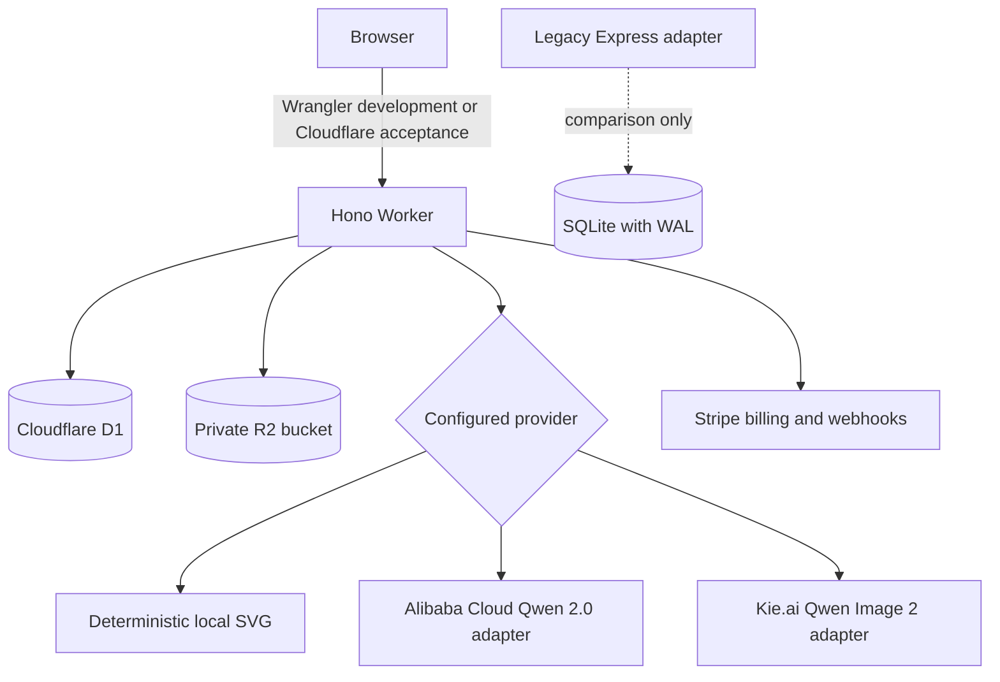
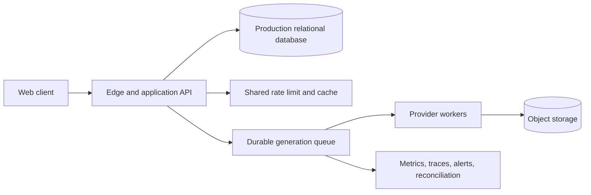

# Architecture

Last verified: July 24, 2026

This document describes the repository as it exists. Future architecture is clearly labeled and must not be presented as current behavior.

## Current Runtimes

The browser never calls Qwen, Stripe, OAuth token endpoints, or email providers directly. Provider credentials remain server-side. The deployed custom-domain environment is an acceptance target, not an approved production launch.

## Components

| Component | Source | Responsibility |
|---|---|---|
| React application | `src/App.tsx` | Client routing, session bootstrap, theme, page composition, verification/reset callbacks |
| Search entry documents | `vite.config.ts`, `src/prerender.tsx`, `src/seo.ts`, `worker/index.ts`, `index.html` | Build-time independent HTML for every published public route from one route/content manifest; the Worker serves the matching artifact, normalizes canonical and `og:url` to the configured origin, and returns a dedicated noindex 404 for unknown routes |
| Navigation | `src/components/Header.tsx` | Desktop/mobile public routes and signed-in account actions |
| Generator workspace | `src/components/GeneratorWorkspace.tsx` | Prompt/settings UI and synchronous submission lifecycle; it emits started, completed, and failed states so Studio can render the request in place, while the public entry opens Studio Create after success |
| Authentication UI | `src/components/AuthDialog.tsx` | Google-only customer sign-in entry with runtime availability detection |
| Studio | `src/components/Studio.tsx` | Responsive authenticated shell, chronological prompt/response conversation with optimistic generation state, complete History archive, shared generation actions, aggregate overview, projects, credits, billing/payments, keys, private support conversations, profile, settings, and deletion confirmation |
| Canonical API | `worker/index.ts` | Same-origin routes, authentication, ownership, credits, generation, billing, maintenance, and HTTP composition |
| Credit service | `worker/credits.ts` | Exactly-once grants plus atomic reservation, settlement, and refund statements |
| OAuth adapter | `worker/oauth.ts` | D1-backed state, PKCE authorization, token exchange, and verified identity mapping |
| External request boundary | `worker/external.ts` | Bounded timeouts, normalized errors, redirect control, and trusted URL validation |
| Maintenance service | `worker/maintenance.ts` | Billing retries, stale-task recovery, retention, and R2 cleanup compensation |
| Runtime contract | `worker/env.ts` | Worker bindings, non-secret variables, and managed-secret names |
| D1 migrations | `worker/migrations/` | Forward-only schema for identity, credits, generation state, billing, maintenance, OAuth, and cleanup compensation |
| Legacy comparison adapter | `server/` | Preserved Express/SQLite implementation; excluded from active development and deployment scripts |

## Trust Boundaries

### Browser to API

- Account sessions use opaque HttpOnly cookies. Signed-out visitors receive no generation identity or allowance.
- Worker passwords use Web Crypto PBKDF2-SHA-256 with per-password salts and encoded work factors.
- API keys use a Bearer token whose hash is stored in D1.
- Client-provided project IDs are checked against the authenticated owner.
- Client-provided billing quantities and prices are ignored; offers come from server configuration.
- API keys carry explicit scopes; authenticated API calls persist status, duration, request ID, user, and key association.
- IP rate-limit buckets are persisted in D1 in Wrangler development and the acceptance runtime.

### API to external providers

- OAuth state is one-time and PKCE protects authorization-code exchange.
- OAuth access tokens are not persisted.
- Stripe webhooks are verified against the raw body with timestamped HMAC.
- Qwen API and asset URLs require HTTPS and exact configured hostnames; redirects are rejected. Assets also require PNG/JPEG/WebP MIME and file signatures and a 25 MB limit.
- OAuth, email, Stripe, Qwen generation, and provider-asset requests use explicit timeouts.

## Persistence Models

The canonical Worker uses D1 for relational records and a private R2 bucket for original generation bytes in both Wrangler development and the acceptance runtime. R2 keys are stored in D1 and never exposed as public object URLs. SQLite remains only in the legacy comparison adapter.

| Table | Current role |
|---|---|
| `users` | Email identity, password hash, verification state, timestamps |
| `sessions` | Hashed account sessions, expiry, user agent, network hint, activity |
| `anonymous_sessions` | Legacy cleanup-only rows retained so previously created guest data can expire safely; new sessions are not issued |
| `security_tokens` | One-time verification and password-reset tokens |
| `oauth_states` | One-time provider state and PKCE verifier |
| `oauth_identities` | Durable provider subject to user mapping |
| `projects` | User-owned organization and archive state |
| `generations` | Prompt, settings, status, ownership, cost, provider/model, and local bytes or an R2 object key |
| `credit_accounts` | Available and reserved balances |
| `credit_ledger` | Append-only product credit events |
| `api_keys` | Prefix, secret hash, scopes, last-use time, and revocation |
| `api_request_logs` | API key/user association, route, status, latency, and request ID |
| `support_tickets` | User-owned request metadata, priority, lifecycle status, and last-message time |
| `support_messages` | Ordered user/support conversation entries linked to an owned ticket |
| `idempotency_keys` | User/key to generation mapping with 24-hour lookup |
| `generation_requests` | Concurrent idempotency claim, processing, completion, and stable failure state |
| `billing_accounts` | Stripe identifiers, local subscription state, and financial-review block |
| `billing_price_versions` | Immutable Stripe Price-to-offer/amount/credits versions; one active checkout version per offer |
| `billing_orders` | Checkout session, price-version snapshot, amount, credits, fulfillment, and financial state |
| `billing_checkout_attempts` | Pre-Stripe recoverable order intent, accepted policy version/time, and Checkout association |
| `billing_terms_acceptances` | Account, policy version, acceptance time, coarse IP hint, and user-agent evidence |
| `billing_events` | Retryable processing/completed/failed Stripe event state and attempts |
| `billing_payments` | PaymentIntent-to-user/order/invoice/Price-version mapping for refunds, disputes, and recurring grants |
| `billing_risk_events` | Local-payment Stripe Radar warning evidence and operator-review state |
| `billing_reviews` | One consolidated refund/dispute/Radar review and cumulative credit exposure per PaymentIntent |
| `billing_review_events` | Every Stripe trigger associated with the consolidated review |
| `billing_review_actions` | Idempotent operator decisions, notes, identities, and per-action credit recovery |
| `operational_alert_state` | Billing-health fingerprint, delivery timestamps, recovery state, and last external-delivery error |
| `operational_alert_deliveries` | Audited alert, reminder, recovery, and idempotent operator-test deliveries |
| `rate_limit_buckets` | Persistent request window counters |
| `maintenance_runs` | Last retention/recovery result |
| `r2_deletion_queue` | Retriable compensation for failed or post-account-deletion object cleanup |
| `account_deletion_jobs`, `account_deletion_audit` | External cleanup progress and durable completion evidence |

D1 uses ordered forward-only SQL migrations in `worker/migrations/`. Backup, restore, lifecycle, and rollback exercises are still required before production approval.

## Transaction Flows

### Signed-out access

1. `/api/session` returns a signed-out state without issuing an anonymous generation cookie.
2. Public examples, models, pricing, and guides remain browsable.
3. Generation, history, private image access, and deletion return `401 UNAUTHENTICATED`.

### Account generation

1. Resolve a cookie session or API key.
2. Validate ownership and idempotency.
3. A unique idempotency claim elects one executor; concurrent requests receive `409 REQUEST_IN_PROGRESS`.
4. Move cost from available to reserved, append a reservation entry, and store the processing generation in one D1 batch.
5. Success stores the image and appends settlement; failure appends refund and restores available balance.

The 15-minute maintenance pass marks stale processing generations failed, settles completed stranded reservations, refunds failed/stale account reservations, drains legacy guest assets, and processes R2 cleanup compensation. Generation execution remains synchronous and has no durable queue.

### Customer sign-in and retained credential routes

1. The customer-facing authentication dialog exposes Google only and checks runtime availability before offering the OAuth entry.
2. The callback verifies browser-bound state and PKCE, requires a verified provider email, creates or resolves the account, grants the idempotent 20-credit welcome amount, and creates a session.
3. Email/password registration, login, verification, and recovery endpoints remain in the Worker and pass local integration tests, but no customer-facing UI exposes them and the canonical acceptance runtime has no transactional account-email provider.
4. In those retained routes, one-time verification tokens replace older active tokens; consumption marks the address verified without granting additional credits.

### Billing

1. The customer reviews the versioned Billing Terms and Refund Policy and explicitly accepts them; the Worker records the account, version, time, coarse IP hint, and user agent.
2. Checkout verifies that current acceptance and stores a recoverable attempt with the accepted version/time and a local order ID.
3. Stripe Checkout uses that order ID as its Stripe idempotency key and carries the accepted policy version in metadata; the returned session is associated with the attempt.
4. A signed Stripe event atomically claims a retryable processing state; missing local dependencies return a retryable HTTP response.
5. Credit packs map the PaymentIntent to the order; subscription invoices validate Customer, subscription, immutable configured Price version, exact amount/currency, paid state, billing reason, and PaymentIntent before granting the monthly or annual allowance.
6. Refund/dispute events mark financial records and quarantine further credit spending for review.
7. An actionable Radar early fraud warning resolves its Charge to a known local PaymentIntent, records the warning separately from refund/dispute state, and quarantines spending. Warnings for other integrations sharing the Stripe account are ignored after signature verification.
8. Every actionable trigger for one PaymentIntent joins one review. An authenticated operator can clear a false positive or confirm a loss with a required idempotency key, identity, and note. Confirmed-loss recovery subtracts only available credits, records a ledger adjustment, and leaves spending blocked while any exposure remains.
9. The 15-minute schedule evaluates aggregate failed/stale event and review counters, sends deduplicated alert/reminder/recovery email, and audits delivery without exposing customer data in the message.
10. Account deletion checkpoints subscription cancellation and Customer deletion, atomically queues owned R2 keys before removing D1 identity state, and retains a deletion audit. Failed object cleanup is retried by maintenance.

`BILLING_ENABLED` gates new Checkout creation, not settlement or cleanup. `BILLING_OPERATOR_TOKEN` independently protects the review queue, resolution routes, and idempotent external-alert test. When Stripe credentials remain configured, signed webhooks continue to drain existing financial events and account deletion can still remove external customer state. These paths are locally regression-tested and restricted-key/signed-webhook smoke-tested. The canonical acceptance environment uses an explicit owner-approved `true` override; production-approved public billing remains blocked until the applicable alerting, reconciliation, commercial/legal, and release evidence passes [Release Readiness](./RELEASE_READINESS.md).

## Current Deployment Shape

- Development: Wrangler serves the built client and same-origin Worker on port 8787 with local D1/R2 emulation.
- Local release smoke: `npm start` rebuilds the client, applies local D1 migrations, and starts the same Worker entry.
- Default build/deploy/CI paths exclude Express and SQLite.
- The retained container runs the legacy Node/SQLite comparison adapter and is local-only.
- Acceptance: `https://qwen-image-3.net` serves the React bundle plus Hono Worker; `www` permanently redirects to the apex domain. D1 database `qwen-image-3-production` and private R2 bucket `qwen-image-3-assets` are bound. `https://qwen-image-3.pages.dev` remains a fallback.
- The exact deployed source state, Worker version, rollback identifiers, live-smoke evidence, and deferred gates are maintained only in [Release Readiness](./RELEASE_READINESS.md). The current Cloudflare acceptance Worker renders the account prompt/response conversation in Studio Create, keeps the composer available, and shares generation actions with History. A signed-in canonical browser loaded that deployed conversation shell and fixed composer without an application console error; the generating-to-complete/failed transitions were verified locally but were not re-exercised against the paid provider during deployment smoke. The canonical catalog and prerendered HTML omit the inactive local preview model, and the deterministic adapter remains selected only by local development and the separately deployed Pages fallback. D1 restore, Kie.ai failure/timeout behavior, and provider commercial approval remain open.
- Google OAuth is the only customer-facing sign-in method. It completed one acceptance sign-in and its external Google Auth Platform application is published with status `Production`. Retained email/password and GitHub routes are not offered in the UI. Acceptance Checkout is enabled; production-approved public billing, production email, GitHub OAuth, and Alibaba Qwen execution remain unapproved or unverified. The Kie.ai Worker-side result does not approve production use, and neither the OAuth publishing label nor the custom domain approves a production launch.

## Target Evolution

Migration gates:

1. Exercise versioned migrations with production backup/restore and rollback evidence.
2. Separate generation submission from worker execution with durable states.
3. Approve and exercise D1/R2 lifecycle, backup, restore, deletion, and rollback policies.
4. Validate D1 rate-limit behavior under load or move limits to a dedicated shared service; add account/key budgets, retry budgets, and circuit breakers.
5. Add automated payment reconciliation and operator alerts around the implemented external account lifecycle.
6. Prove rollback and live acceptance before declaring a production release.
