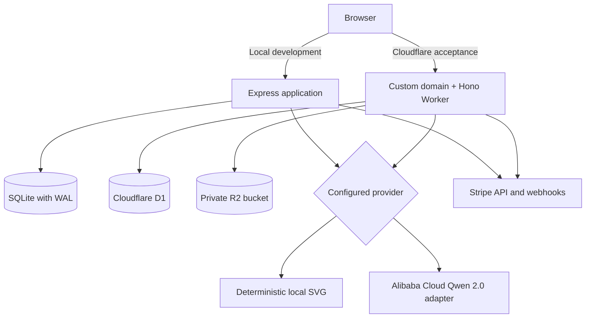
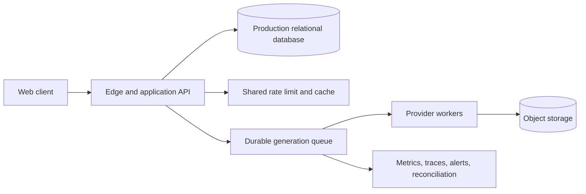

# Architecture

Last verified: July 23, 2026

This document describes the repository as it exists. Future architecture is clearly labeled and must not be presented as current behavior.

## Current Runtimes

The browser never calls Qwen, Stripe, OAuth token endpoints, or email providers directly. Provider credentials remain server-side. The deployed custom-domain environment is an acceptance target, not an approved production launch.

## Components

| Component | Source | Responsibility |
|---|---|---|
| React application | `src/App.tsx` | Client routing, session bootstrap, theme, page composition, verification/reset callbacks |
| Search entry document | `vite.config.ts`, `src/prerender.tsx`, `index.html` | Build-time homepage prerender plus canonical, social, and structured metadata for first-response crawler access |
| Navigation | `src/components/Header.tsx` | Desktop/mobile public routes and signed-in account actions |
| Generator workspace | `src/components/GeneratorWorkspace.tsx` | Prompt/settings UI, synchronous submission, result/history actions |
| Authentication UI | `src/components/AuthDialog.tsx` | Login, registration, local verification, recovery, and configured OAuth entry |
| Studio | `src/components/Studio.tsx` | Projects, history, favorites, credits, billing, keys, settings, and deletion confirmation |
| API application | `server/app.ts` | HTTP routes, validation, ownership, quotas, generation, billing webhook dispatch, and static serving |
| Persistence | `server/db.ts` | SQLite schema, transactions, queries, migrations, and account cascades |
| Cloudflare API | `worker/index.ts` | Same-origin Hono routes, Web Crypto authentication, D1 accounting, R2 assets, Stripe webhook processing, and Pages asset fallback |
| D1 migrations | `worker/migrations/` | Production-shaped relational schema for users, sessions, credits, generations, billing, and rate limits |
| Provider boundary | `server/providers/` | Active local or Alibaba Cloud generation provider |
| External adapters | `server/oauth.ts`, `server/mailer.ts`, `server/billing.ts` | OAuth profile exchange, email delivery, Stripe requests, and webhook verification |
| Runtime configuration gate | `server/config.ts` | Reject unsafe production email, cookies, storage, provider, asset-host, and billing configuration |

## Trust Boundaries

### Browser to API

- Account and guest sessions use opaque HttpOnly cookies.
- Local passwords use salted scrypt; Cloudflare passwords use Web Crypto PBKDF2-SHA-256 with per-password salts and encoded work factors.
- API keys use a Bearer token whose hash is stored in SQLite or D1.
- Client-provided project IDs are checked against the authenticated owner.
- Client-provided billing quantities and prices are ignored; offers come from server configuration.
- API keys carry explicit scopes; authenticated API calls persist status, duration, request ID, user, and key association.
- IP rate-limit buckets are persisted in SQLite locally and D1 in the acceptance runtime.

### API to external providers

- OAuth state is one-time and PKCE protects authorization-code exchange.
- OAuth access tokens are not persisted.
- Stripe webhooks are verified against the raw body with timestamped HMAC.
- Qwen assets require approved HTTPS host suffixes, public DNS results, bounded redirects, PNG/JPEG/WebP MIME and file signatures, and a 25 MB limit.
- OAuth, email, Stripe, Qwen generation, and provider-asset requests use explicit timeouts.

## Persistence Models

Local SQLite runs in WAL mode with foreign keys and a five-second busy timeout. The deployed Worker uses D1 for relational records and a private R2 bucket for original generation bytes. R2 keys are stored in D1 and never exposed as public object URLs.

| Table | Current role |
|---|---|
| `users` | Email identity, password hash, verification state, timestamps |
| `sessions` | Hashed account sessions, expiry, user agent, network hint, activity |
| `anonymous_sessions` | Hashed guest cookie, UTC quota date/count, 30-day expiry |
| `security_tokens` | One-time verification and password-reset tokens |
| `oauth_states` | One-time provider state and PKCE verifier |
| `oauth_identities` | Durable provider subject to user mapping |
| `projects` | User-owned organization and archive state |
| `generations` | Prompt, settings, status, ownership, cost, provider/model, and local bytes or an R2 object key |
| `credit_accounts` | Available and reserved balances |
| `credit_ledger` | Append-only product credit events |
| `api_keys` | Prefix, secret hash, scopes, last-use time, and revocation |
| `api_request_logs` | API key/user association, route, status, latency, and request ID |
| `idempotency_keys` | User/key to generation mapping with 24-hour lookup |
| `billing_accounts` | Stripe identifiers, local subscription state, and financial-review block |
| `billing_price_versions` | Immutable Stripe Price-to-offer/amount/credits versions; one active checkout version per offer |
| `billing_orders` | Checkout session, price-version snapshot, amount, credits, fulfillment, and financial state |
| `billing_events` | Retryable processing/completed/failed Stripe event state and attempts |
| `billing_payments` | PaymentIntent-to-user/order/invoice/Price-version mapping for refunds, disputes, and recurring grants |
| `rate_limit_buckets` | Persistent request window counters |
| `maintenance_runs` | Last retention/recovery result |
| `schema_migrations` | Applied schema version, name, and timestamp |

Local schema evolution records each additive upgrade in `schema_migrations` and applies it under `BEGIN IMMEDIATE`. D1 uses ordered SQL migrations in `worker/migrations/`. Backup, restore, lifecycle, and rollback exercises are still required before production approval.

## Transaction Flows

### Guest generation

1. `/api/session` creates or resumes an anonymous session.
2. `/api/generations` validates prompt and settings.
3. The active relational store atomically increments the UTC daily quota count.
4. A processing generation row is stored.
5. The active provider runs synchronously.
6. Success stores the image; failure marks the row failed and decrements quota.

### Account generation

1. Resolve a cookie session or API key.
2. Validate ownership and idempotency.
3. Move cost from available to reserved and append a reservation entry in one transaction.
4. Store the processing generation and call the provider.
5. Success stores the image and appends settlement; failure appends refund and restores available balance.

A startup and 15-minute maintenance transaction marks stale processing generations failed, settles completed stranded reservations, refunds failed/stale reservations, and restores same-day guest quota. Generation execution remains synchronous and has no durable queue.

### Registration and verification

1. Registration creates the user, zero-balance account, billing row, and account session.
2. Eligible generations from the active guest session and previous 24 hours move to the account.
3. A one-time verification token is delivered through console or Resend.
4. Token consumption marks the address verified and grants 20 credits once.

### Billing

1. The server selects a configured offer and creates Stripe Checkout.
2. A local pending order is written after Checkout returns.
3. A signed Stripe event atomically claims a retryable processing state; missing local dependencies return a retryable HTTP response.
4. Credit packs map the PaymentIntent to the order; Creator invoices validate Customer, subscription, configured Price, exact USD 800 or 1000 amount, paid state, billing reason, and PaymentIntent before granting.
5. Refund/dispute events mark financial records and quarantine further credit spending for review.
6. Account deletion cancels a known subscription and deletes the Stripe Customer before local data is removed; failure preserves local identity.

`BILLING_ENABLED` gates new Checkout creation, not settlement or cleanup. When Stripe credentials remain configured, signed webhooks continue to drain existing financial events and account deletion can still remove external customer state. These paths are locally regression-tested and restricted-key/signed-webhook smoke-tested, but remain blocked for public billing until paid Stripe test-mode, reconciliation, policy, and legal evidence passes [Release Readiness](./RELEASE_READINESS.md).

## Current Deployment Shape

- Development: Vite on `127.0.0.1:5173`; Express on `127.0.0.1:8787`.
- Emitted local build: Express serves `dist/` and API routes on port 8787.
- Production entry: `server/config.ts` fails closed on local provider/email, insecure cookies/URLs, ephemeral storage, missing trusted asset hosts, or incomplete enabled billing.
- Container: a multi-stage Node 22 Alpine image runs as the `node` user with a named SQLite volume.
- Acceptance: `https://qwen-image-3.net` serves the React bundle plus Hono Worker; `www` permanently redirects to the apex domain. D1 database `qwen-image-3-production` and private R2 bucket `qwen-image-3-assets` are bound. `https://qwen-image-3.pages.dev` remains a fallback.
- Live smoke passed for health, guest cookie, ten-minute promotion persistence, free-queue generation, D1 metadata, R2-backed retrieval, and watermarked export.
- Billing, email, OAuth, and real Qwen execution remain disabled/unverified; the custom domain does not by itself approve a production launch.

## Target Evolution

Migration gates:

1. Exercise versioned migrations with production backup/restore and rollback evidence.
2. Separate generation submission from worker execution with durable states.
3. Approve and exercise D1/R2 lifecycle, backup, restore, deletion, and rollback policies.
4. Validate D1 rate-limit behavior under load or move limits to a dedicated shared service; add account/key budgets, retry budgets, and circuit breakers.
5. Add automated payment reconciliation and operator alerts around the implemented external account lifecycle.
6. Prove rollback and live acceptance before declaring a production release.
